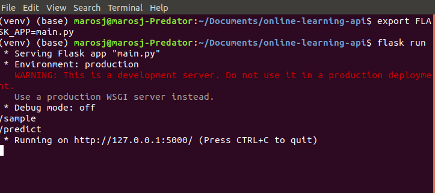
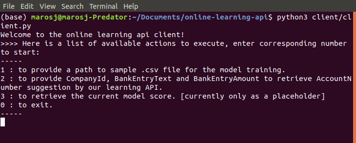

# online-learning-api
*Prepared by Maros Jevocin*

Hiring Assignment for Data Engineer position at Visma. For a full assignment description, please visit the [GitHub repository with the assignment details](https://github.com/e-conomic/hiring-assignments/tree/master/machinelearningteam/online-learning-api).

The aim of this project is to build a self-training machine learning API for bookkeeping and a client which could communicate with the API.
We used the python flask library for setting the web API and prepared a simplified python client executable from the command line. As this is at the POC level, a local host is being used to run the API.


## Steps to run on Linux/Mac
Technical detials in a case you would like to try this out:

**API:** <br/>
runtime env: Python 3.7.4,
core libraries:
dill==0.3.4
Flask==1.1.1
jsonschema==3.2.0
numpy==1.18.1
pandas==1.3.5
scikit-learn==1.0.2
scipy==1.4.1
sklearn==0.0

**Client:**<br/>
runtime env: Python 3.7.4, core libraries:
dill==0.3.4
requests==2.18.4
requests-unixsocket==0.1.5
simplejson==3.13.2
numpy==1.18.1
pandas==1.3.5

## API
If you have the flask library installed, open the command line and go to the online-learning-app directory with the code.
Now you can run the API using following commands

```
$ export FLASK_APP=main.py

$ flask run
```

This will start the API on your local host and you are ready to send http calls.
At this point you should see something like this:



You should be able to see http paths for available requests.

## Client
For communication with out API we can use client.py in the *client* folder.

First off, in the client.py file, change the **api_url** to a value from your local server. (see the last line in the terminal with running flask app: Running on http://127.0.0.1:5000/ , copy the whole http link except final / symbol and paste into the variable like this: 'http://127.0.0.1:5000')
Save the changed file and open a new terminal window. Go to the online-learning-app directory and execute:

```
$ python3 ./client/client.py
```

The client will provide you further instructions how to work with it.
At this point you should see something like this:




### Some notes regarding the client
- in the option 1, you can use relative path to .csv file when using linux or mac OS
- when the option 1 is executed, you can see that score is being printed on the server side (opened terminal with running flask app), that way I was able to check if model is learning
- for the option 2, feel free to copy a sample prepared in *predict_sample.txt* or use your own
- option 3 is optional, currently only as a placeholder, can be added if recommended for further testing my skills 

## Production ready API diagram


For a production ready state we could start with a solution schematically shown on the image above.

1. Since the solution should be provided only to a selected number of users, we propose to add an authentication method in order to get to the server.
2. The server would live either on-prem or on a cloud (e.g. Google Cloud or AWS Cloud).
3. The access through the cloud would be through API Gateway which could be the interface between our api and clients, in case of need, it could handle load balancing in case of heavy traffic and would evaluate policies if the connecting user should be able to use a selected method. (e.g. maybe not everyone can send a sample or monitor the model)
4. After evaluating policies, the http method would be executed and would access resources stored on the server: the model if it exists, and a .csv file with samples. (the order list is an idea to solve a concern mentioned later in a next section)

## Final Concerns and possible solutions
1. going live - consider place to deploy for the production (AWS, Google Cloud, custom solution)
2. bad data - implement some data validation logic
3. handling multiple requests at once and how not to lose any model improvement and data samples caused by overlapping http calls
- API Gateway as as mediator
- having http methods create orders for accessing the model
4. web API attacks
    - adding an authorization
    - hiding behind firewall/VPN
    - adding forced delays for bot attacks
    - would need to discover more available options
5. handling API errors, provide error HTTP status codes
6. make user data secure - SSL certificate / 3rd party solution such as Google Cloud services
7. who can access which methods (can everyone send samples?) - Policies
8. add versioning to API paths, if a new version should break client's app
